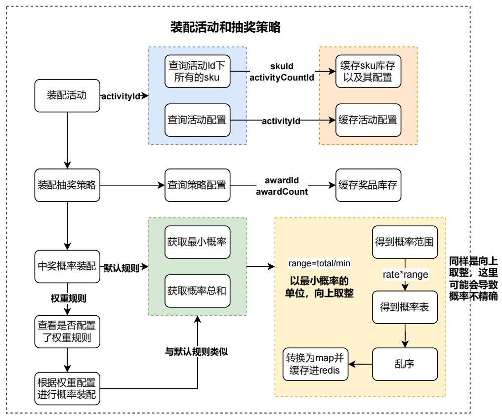
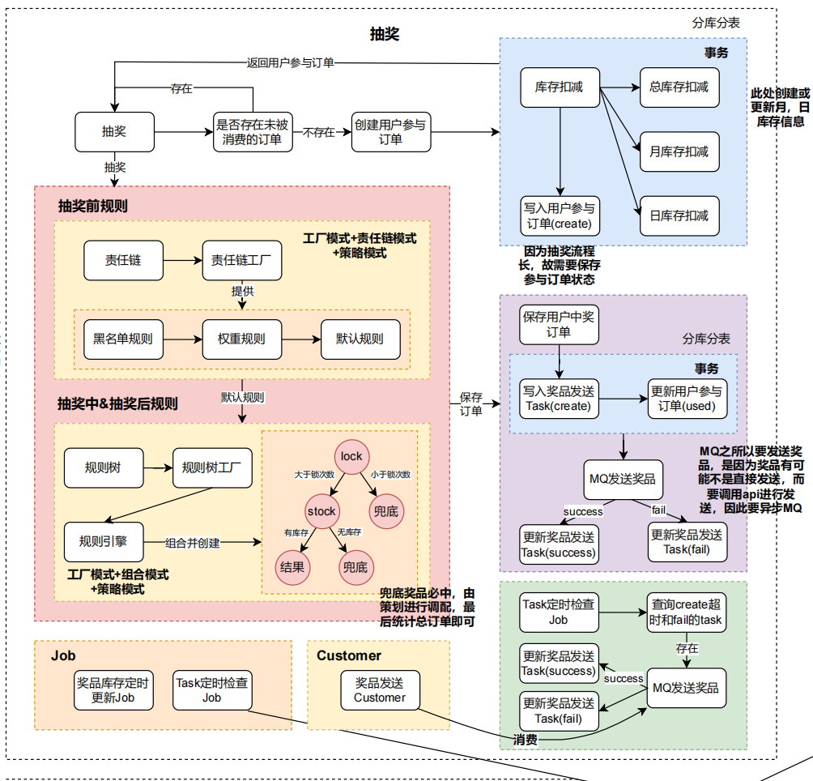
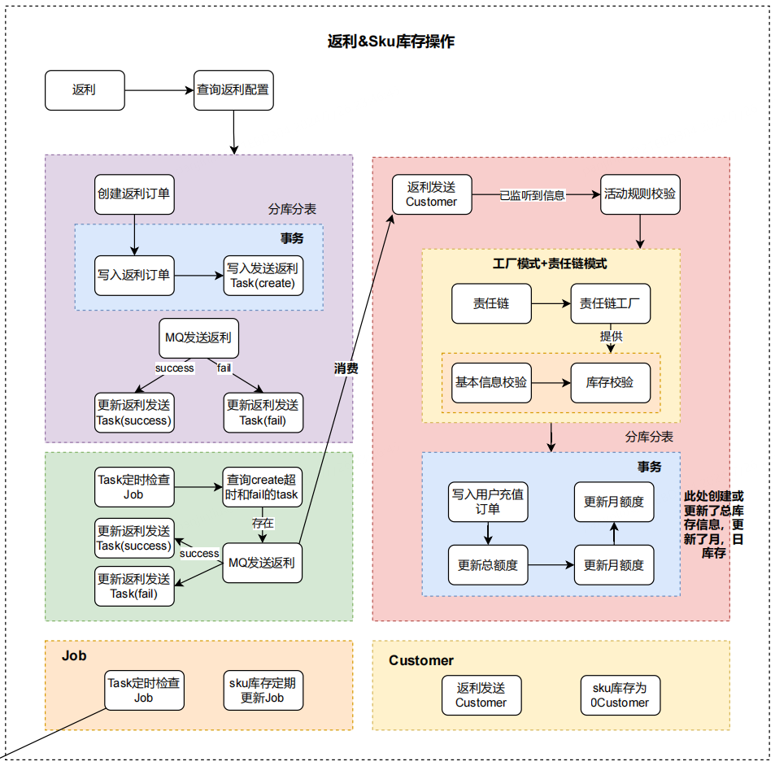

# Magic Lottery - 幸运抽奖平台

## 目录

- [1 项目概述](#1-项目概述)

- [2 技术栈](#2-技术栈)

- [3 核心流程](#3-核心流程)
  - [3.1 策略装配过程](#31-策略装配过程)

  - [3.2 抽奖过程](#32-抽奖过程)

  - [3.3 返利和库存过程](#33-返利和库存过程)

- [4 挑战与解决方案](#4-挑战与解决方案)

- [5 项目截图](#5-项目截图)

> &#x20;   在日益增长的电商市场竞争中，提高用户参与度和购买频率成为了许多电商平台的关键目标。“幸运抽奖”活动应运而生，旨在通过游戏化的抽奖机制激励用户更频繁地参与电商活动。例如，用户在“XX网购”平台上每完成一次购物，不仅能获得积分，还能获得参加抽奖活动的机会。
> &#x20;   通过“幸运抽奖”，电商平台不仅提升了用户体验，增加了用户与平台的互动频次，还通过数据驱动的方法持续优化营销策略，实现了商业价值的最大化。

# 1 项目概述

&#x20;   Magic Lottery 是一个高性能的幸运抽奖服务平台，允许电商网站用户通过日常行为如签到、购买商品等获得抽奖机会。该系统支持高并发访问，保证抽奖过程的流畅性与数据一致性。

# 2 技术栈

- **后端**: `Java`, `Spring Boot`
- **数据库**: `MySQL`（实现分库分表以支持大规模数据处理）
- **缓存**: `Redis`（用于减轻数据库压力，提高查询速度）
- **消息队列**: `RabbitMQ`（处理异步任务，如发送通知、处理用户抽奖行为等）

# 3 核心流程

## 3.1 策略装配过程

## 3.2 抽奖过程

## 3.3 返利和库存过程

# 4 挑战与解决方案

- **高并发处理**: 通过`Redis`实现热点数据的缓存，显著提高系统响应速度并减少数据库压力。
- **数据分片**: 使用`MySQL`分库分表技术，有效管理大规模数据，提高查询效率和数据存储能力。
- **系统可靠性**: 引入`RabbitMQ`处理异步消息，确保系统的高可用性和弹性。

# 5 项目截图

感谢@liuzhonghang帮忙搭的前端框架\~

