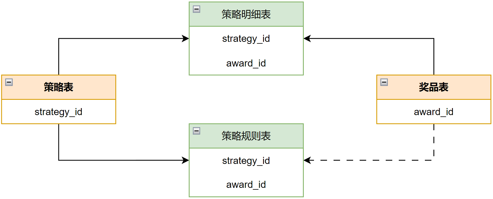

# Magic Lottery - 分布式抽奖营销平台

## 目录

- [1 项目描述](#1-项目描述)
- [2 项目实现](#2-项目实现)
  - [2.1 数据库设计](#21-数据库设计)
    - [2.1.1 抽奖策略领域](#211-抽奖策略领域)
- [3 项目部署](#3-项目部署)

***

# 1 项目描述

# 2 项目实现

## 2.1 数据库设计

### 2.1.1 抽奖策略领域

1. **奖品表**\*\*`award`\*\*

| **字段名称**       | **数据类型**         | **非空** | **默认值**            | **字段描述**                |
| -------------- | ---------------- | ------ | ------------------ | ----------------------- |
| `id`           | int(11) unsigned | 是      | 自增                 | 自增ID                    |
| `award_id`     | int(8)           | 是      | 无                  | 抽奖奖品ID - 内部流转使用         |
| `award_key`    | varchar(32)      | 是      | 无                  | 奖品对接标识 - 每一个都是一个对应的发奖策略 |
| `award_config` | varchar(32)      | 是      | 无                  | 奖品配置信息                  |
| `award_desc`   | varchar(128)     | 是      | 无                  | 奖品内容描述                  |
| `create_time`  | datetime         | 是      | CURRENT\_TIMESTAMP | 创建时间                    |
| `update_time`  | datetime         | 是      | CURRENT\_TIMESTAMP | 更新时间                    |

1. **策略表**\*\*`strategy`\*\*

| **字段名称**        | **数据类型**            | **非空** | **默认值**            | **字段描述** |
| --------------- | ------------------- | ------ | ------------------ | -------- |
| `id`            | bigint(11) unsigned | 是      | 自增                 | 自增ID     |
| `strategy_id`   | bigint(8)           | 是      | 无                  | 抽奖策略ID   |
| `strategy_desc` | varchar(128)        | 是      | 无                  | 抽奖策略描述   |
| `create_time`   | datetime            | 是      | CURRENT\_TIMESTAMP | 创建时间     |
| `update_time`   | datetime            | 是      | CURRENT\_TIMESTAMP | 更新时间     |

1. **策略明细表**\*\*`strategy_award`\*\*

| **字段名称**              | **数据类型**            | **非空** | **默认值**            | **字段描述**                 |
| --------------------- | ------------------- | ------ | ------------------ | ------------------------ |
| `id`                  | bigint(11) unsigned | 是      | 自增                 | 自增ID                     |
| `strategy_id`         | bigint(8)           | 是      | 无                  | 抽奖策略ID                   |
| `award_id`            | int(8)              | 是      | 无                  | 抽奖奖品ID - 内部流转使用          |
| `award_title`         | varchar(128)        | 是      | 无                  | 抽奖奖品标题                   |
| `award_subtitle`      | varchar(128)        | 否      | 无                  | 抽奖奖品副标题                  |
| `award_count`         | int(8)              | 是      | '0'                | 奖品库存总量                   |
| `award_count_surplus` | int(8)              | 是      | '0'                | 奖品库存剩余                   |
| `award_rate`          | decimal(6,4)        | 是      | 无                  | 奖品中奖概率                   |
| `rule_models`         | varchar(256)        | 否      | 无                  | 规则模型，rule配置的模型同步到此表，便于使用 |
| `sort`                | int(2)              | 是      | '0'                | 排序                       |
| `create_time`         | datetime            | 是      | CURRENT\_TIMESTAMP | 创建时间                     |
| `update_time`         | datetime            | 是      | CURRENT\_TIMESTAMP | 修改时间                     |

1. **策略规则表**\*\*`strategy_rule`\*\*

| **字段名称**      | **数据类型**            | **非空** | **默认值**            | **字段描述**                 |
| ------------- | ------------------- | ------ | ------------------ | ------------------------ |
| `id`          | bigint(11) unsigned | 是      | 自增                 | 自增ID                     |
| `strategy_id` | int(8)              | 是      | 无                  | 抽奖策略ID                   |
| `award_id`    | int(8)              | 否      | 无                  | 抽奖奖品ID【规则类型为策略，则不需要奖品ID】 |
| `rule_type`   | tinyint(1)          | 是      | '0'                | 抽象规则类型【1-策略规则、2-奖品规则】    |
| `rule_model`  | varchar(16)         | 是      | 无                  | 抽奖规则类型                   |
| `rule_value`  | varchar(64)         | 是      | 无                  | 抽奖规则比值                   |
| `rule_desc`   | varchar(128)        | 是      | 无                  | 抽奖规则描述                   |
| `create_time` | datetime            | 是      | CURRENT\_TIMESTAMP | 创建时间                     |
| `update_time` | datetime            | 是      | CURRENT\_TIMESTAMP | 更新时间                     |

# 3 项目部署
